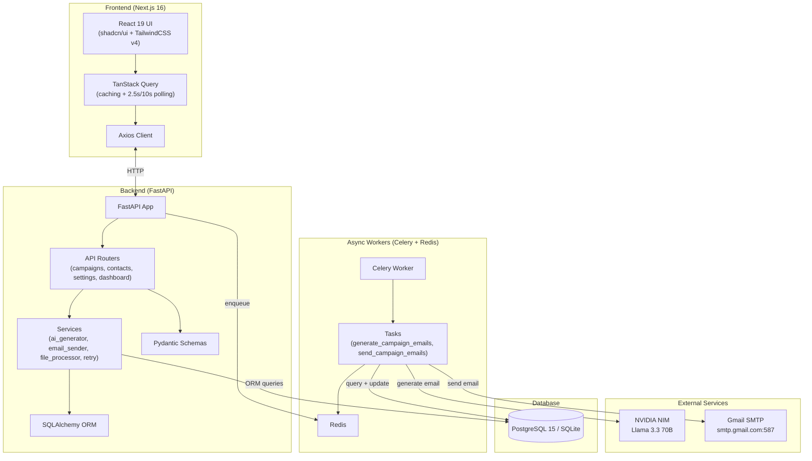

# AI Personalized Email Outreach Agent

> An end-to-end solution for AI-powered personalized email campaigns with bulk contact management, real-time progress tracking, and rate-limited Gmail SMTP delivery.

---

## Features

- **AI-Powered Personalization** — Uses NVIDIA NIM (Llama 3.3 70B) to generate context-aware, personalized email content for each contact based on custom prompt templates and contact attributes
- **Multi-Format File Import** — Supports CSV, Excel (XLSX/XLS), PDF (table extraction), and TXT (key:value pairs) with automatic column detection, validation, and deduplication
- **Campaign Lifecycle Management** — Full CRUD with status workflow: `Draft → Generating → Generated → Sending → Completed`, with Pause/Resume/Stop controls
- **Email Preview & Approval** — Review, edit (subject/body), regenerate (re-prompt AI), or approve each generated email individually or in bulk
- **Rate-Limited Sending** — Configurable hourly (default 50) and daily (default 400) caps with automatic pause when limits are reached
- **Sequential Delivery Delays** — Configurable delay (10–60s) between sends to avoid spam detection
- **Live Progress Dashboard** — Real-time polling (2.5s) with animated progress bar, terminal-style logs, and live statistics during sending
- **Secure Credential Storage** — Gmail app passwords encrypted at rest using Fernet symmetric encryption
- **SMTP Connection Testing** — Verify Gmail credentials without sending any email
- **Dark Theme UI** — Modern glassmorphism design with consistent dark color scheme

---

## Dev Stack

### Backend

| Layer | Technology | Version |
|-------|-----------|---------|
| Language | Python | 3.12+ |
| Framework | FastAPI | Latest |
| ORM | SQLAlchemy | Latest |
| Database | PostgreSQL 15 (prod) / SQLite (dev) |
| Task Queue | Celery + Redis | Latest |
| AI Client | OpenAI SDK (NVIDIA NIM compatible) | Latest |
| Email | smtplib (stdlib) + Gmail SMTP (STARTTLS) |
| Encryption | Cryptography (Fernet) | Latest |
| File Parsing | pandas, openpyxl, pdfplumber | Latest |

### Frontend

| Layer | Technology | Version |
|-------|-----------|---------|
| Language | TypeScript | 5.x |
| Framework | Next.js (App Router) | 16.2.7 |
| UI Library | React | 19.2.4 |
| CSS Framework | TailwindCSS | v4 |
| UI Components | shadcn/ui (Radix primitives) | Latest |
| State Management | TanStack Query (React Query) | v5 |
| HTTP Client | Axios | 1.x |
| Forms / Validation | React Hook Form + Zod | v7 / v4 |
| Icons | Lucide React | Latest |
| Fonts | Geist (via next/font) | Latest |

### Infrastructure

| Tool | Purpose |
|------|---------|
| Docker + Docker Compose | Multi-service container orchestration |
| Redis | Celery message broker & result backend |
| PostgreSQL 15 | Production database |

---

## System Architecture



---

## Project Structure

```
automatic-mail-sender-agent/
|
+-- backend/
|   +-- Dockerfile                     # Python 3.12-slim container
|   +-- requirements.txt               # Python dependencies
|   +-- app/
|       +-- main.py                    # FastAPI entry point
|       +-- config.py                  # Pydantic Settings (env-based)
|       +-- database.py                # SQLAlchemy engine + session
|       +-- models.py                  # 6 ORM models (User, Campaign, Contact, etc.)
|       +-- schemas.py                 # Pydantic request/response schemas
|       +-- security.py                # Fernet encryption helper
|       +-- celery_app.py              # Celery worker config
|       +-- tasks.py                   # Background tasks (generate + send)
|       +-- api/
|       |   +-- campaigns.py           # Campaign lifecycle endpoints
|       |   +-- contacts.py            # Contact + email management
|       |   +-- settings.py            # Gmail account CRUD
|       |   +-- dashboard.py           # Aggregate stats endpoint
|       +-- services/
|           +-- ai_generator.py        # NVIDIA NIM integration
|           +-- email_sender.py        # Gmail SMTP logic
|           +-- file_processor.py      # CSV/XLSX/PDF/TXT parser
|           +-- retry.py               # Linear backoff retry utility
|
+-- frontend/
|   +-- Dockerfile                     # Node 20 multi-stage build
|   +-- package.json                   # Dependencies & scripts
|   +-- next.config.ts                 # Next.js config
|   +-- src/
|       +-- app/
|       |   +-- page.tsx               # Dashboard (stats, recent campaigns/logs)
|       |   +-- layout.tsx             # Root layout (sidebar, fonts, dark theme)
|       |   +-- providers.tsx          # TanStack Query provider
|       |   +-- campaigns/
|       |   |   +-- page.tsx           # Campaign list
|       |   |   +-- create/page.tsx    # Create campaign form + file upload
|       |   |   +-- [id]/
|       |   |       +-- preview/       # AI email preview, edit, approve
|       |   |       +-- progress/      # Live sending progress + logs
|       |   +-- logs/page.tsx          # Activity log table
|       |   +-- settings/page.tsx      # Gmail accounts + NVIDIA config
|       |   +-- profile/page.tsx       # User stats & connected accounts
|       +-- components/
|       |   +-- sidebar.tsx            # Navigation sidebar
|       |   +-- status-badge.tsx       # Color-coded status pill
|       |   +-- ui/                    # shadcn/ui primitives
|       +-- lib/
|           +-- api.ts                 # Axios client
|           +-- hooks.ts              # TanStack Query hooks (all API calls)
|           +-- types.ts              # TypeScript interfaces
|           +-- utils.ts              # cn() utility
|
+-- docker-compose.yml                 # 5 services: backend, celery, db, redis, frontend
+-- .env.example                       # Environment variable template
+-- README.md                          # Project overview & setup guide
```

---

## Database Models

| Model | Key Columns | Purpose |
|-------|-------------|---------|
| `User` | id, email, created_at | Single user profile |
| `GmailAccount` | id, user_id, email, encrypted_password | Connected Gmail accounts |
| `Campaign` | id, name, type, status, prompt_template, tone, length, temperature, delay_seconds | Campaign configuration |
| `Contact` | id, campaign_id, email, name, company, role, website, industry, city, country, linkedin, notes, status, validation_error | Contact records with validation |
| `GeneratedEmail` | id, contact_id, subject, body, status | AI-generated email content |
| `EmailLog` | id, contact_id, status, message, timestamp | Delivery audit trail |

**Campaign statuses**: `Draft`, `Pending`, `Generating`, `Generated`, `Sending`, `Paused`, `Stopped`, `Completed`

---

## API Endpoints

### Campaigns

| Method | Endpoint | Description |
|--------|----------|-------------|
| GET | `/api/campaigns/` | List all campaigns |
| POST | `/api/campaigns/` | Create campaign |
| GET | `/api/campaigns/{id}` | Get campaign details |
| DELETE | `/api/campaigns/{id}` | Delete campaign (cascading) |
| POST | `/api/campaigns/{id}/upload` | Upload contacts file (max 25MB) |
| POST | `/api/campaigns/{id}/generate` | Queue AI generation |
| POST | `/api/campaigns/{id}/send` | Queue sending |
| POST | `/api/campaigns/{id}/pause` | Pause sending |
| POST | `/api/campaigns/{id}/resume` | Resume sending |
| POST | `/api/campaigns/{id}/stop` | Stop sending |
| GET | `/api/campaigns/{id}/stats` | Campaign statistics |
| GET | `/api/campaigns/{id}/logs` | Recent logs (last 100) |

### Contacts & Emails

| Method | Endpoint | Description |
|--------|----------|-------------|
| GET | `/api/contacts/{campaign_id}` | Contacts with generated emails |
| GET | `/api/contacts/{contact_id}/email` | Get single generated email |
| PUT | `/api/contacts/emails/{email_id}/approve` | Approve email |
| PUT | `/api/contacts/emails/{email_id}` | Edit subject/body |
| POST | `/api/contacts/{contact_id}/regenerate` | Regenerate via AI |
| PUT | `/api/contacts/campaigns/{campaign_id}/approve-all` | Approve all pending |

### Settings

| Method | Endpoint | Description |
|--------|----------|-------------|
| GET | `/api/settings/gmail` | List connected accounts |
| POST | `/api/settings/gmail` | Add account (encrypts password) |
| POST | `/api/settings/gmail/{id}/test` | Test SMTP connection |
| DELETE | `/api/settings/gmail/{id}` | Disconnect account |

### Dashboard

| Method | Endpoint | Description |
|--------|----------|-------------|
| GET | `/api/dashboard/stats` | Aggregate stats + recent activity |

---

## Configuration (.env)

```
DATABASE_URL           # postgresql://user:pass@db:5432/email_agent (or sqlite:///./local.db)
REDIS_URL              # redis://redis:6379/0
NVIDIA_NIM_API_KEY     # NVIDIA API key (required)
NVIDIA_NIM_BASE_URL    # https://api.nim.ibm.com/v1 (or custom endpoint)
SMTP_HOST              # smtp.gmail.com
SMTP_PORT              # 587
SECRET_KEY             # General application secret
ENCRYPTION_KEY         # Fernet key for Gmail password encryption
MAX_EMAILS_PER_HOUR    # 50
MAX_EMAILS_PER_DAY     # 400
NEXT_PUBLIC_API_URL    # http://localhost:8000/api
```

---

## Getting Started

### Docker Compose (Recommended)

```bash
cp .env.example .env
# Edit .env with your NVIDIA_NIM_API_KEY
docker-compose up --build
```

Access: `http://localhost:3000`

### Local Development

**Backend:**
```bash
cd backend
python -m venv venv
venv\Scripts\activate    # Windows
pip install -r requirements.txt
uvicorn app.main:app --reload --port 8000
```

**Frontend:**
```bash
cd frontend
npm install
npm run dev
```

---

## Gmail Setup

1. Enable 2-Step Verification on your Google Account
2. Generate an **App Password** (Google Account → Security → App Passwords)
3. Use your full Gmail address and the App Password in the Settings page
4. Click **Test Connection** before using

---

## Stats

| Metric | Value |
|--------|-------|
| Backend lines of code | ~850 |
| Frontend lines of code | ~1,750 |
| Total files | 50+ |
| Python packages | 16 |
| Node packages | 25+ |
| API endpoints | 25 |
| Database tables | 6 |
| Docker services | 5 |
